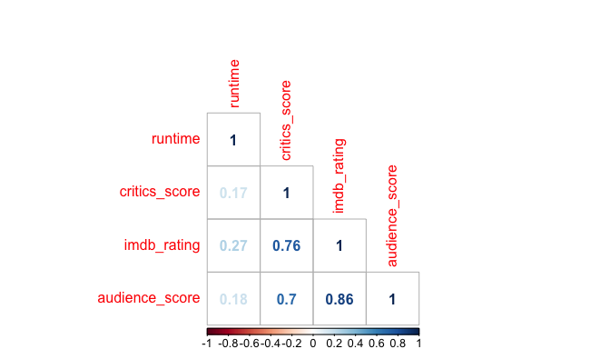
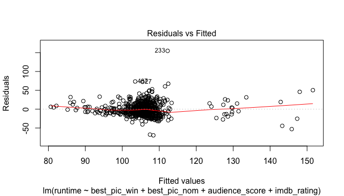
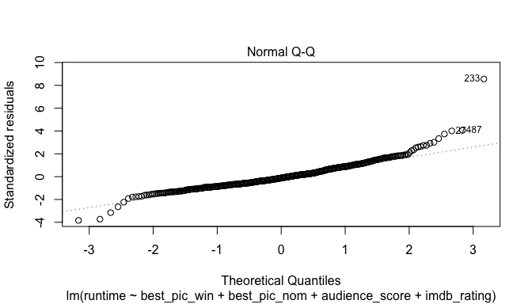
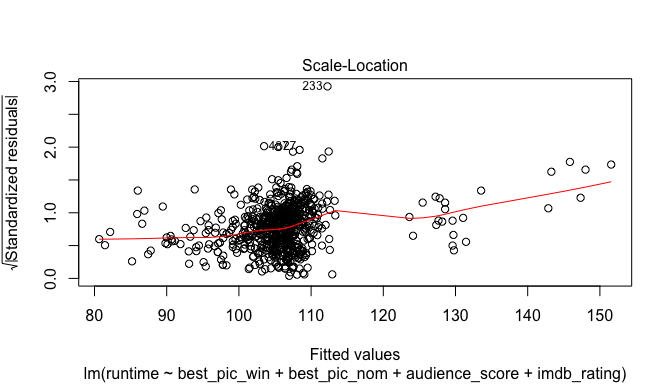
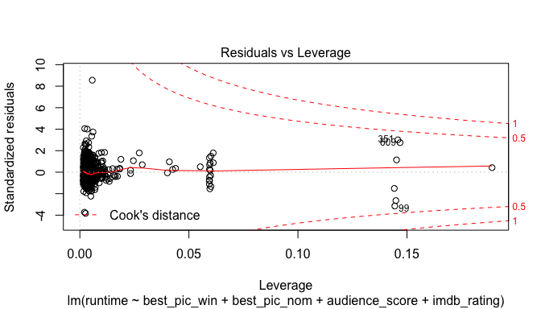

# Modeling and prediction for movies

## Setup

### Load packages


```r
library(ggplot2)
library(dplyr)
library(statsr)
```

### Load data


```r
load("movies.Rdata")
```

* * *

## Part 1: Data

Since the data was randomly sampled, therefore it can be generalised to the population of movies released before 2016. However, since no random assignment was carried out, no causality can come from the data.

* * *

## Part 2: Research question

**Research Question 1**

Does runtime affects imdb rating, critics score, audience score, best picture nomination and best picture win for 2016 movies?

While longer movies have their own virtue, sometime they are long for no particular reason and indeed, their length sometimes affect the quality of the movie. This is basically a question of whether is there a quality and quantity trade off.

* * *

## Part 3: Exploratory data analysis

Before further analysis, NAs must be removed from the data to permit proper analysis.


```r
#isolate data of interest
data0 <- movies[, c("title", "runtime", "critics_score", "imdb_rating", "audience_score", "best_pic_nom", "best_pic_win")]
#remove NAs
data0 <- data0[complete.cases(data0), ]
```

We need to know the general distribution of the numeric variables as well as their correlation to other variables involved.


```r
#summary of data
summary(data0)
```

```
##     title              runtime      critics_score     imdb_rating   
##  Length:650         Min.   : 39.0   Min.   :  1.00   Min.   :1.900  
##  Class :character   1st Qu.: 92.0   1st Qu.: 33.00   1st Qu.:5.900  
##  Mode  :character   Median :103.0   Median : 61.00   Median :6.600  
##                     Mean   :105.8   Mean   : 57.65   Mean   :6.492  
##                     3rd Qu.:115.8   3rd Qu.: 83.00   3rd Qu.:7.300  
##                     Max.   :267.0   Max.   :100.00   Max.   :9.000  
##  audience_score  best_pic_nom best_pic_win
##  Min.   :11.00   no :628      no :643     
##  1st Qu.:46.00   yes: 22      yes:  7     
##  Median :65.00                            
##  Mean   :62.35                            
##  3rd Qu.:80.00                            
##  Max.   :97.00
```

From the summary statistics, it is clear that very few movies get nominated and much less, win best picture award and this is in line with the expectation. Moreover, the scores of the critics, imdb and audience also appear to be distributed differently. Critics appear to be harsher as their mean scores are lower than that from the audience. 


```r
#isolate numerical variables
data.num <- data0[, -c(1, 6:7)]
#creating correlation plot
require(corrplot)
```

```
## Loading required package: corrplot
```

```r
c <- cor(data.num)
corrplot(c, method = c("number"), type = "lower")
```

<!-- -->


There appears to be rating high correlation between imdb rating and audience score at almost 0.9. Another major correlation would be between that of imdb rating and critics score. This might be because those who produce the imdb rating are also the critics. Hence, either one of these ratings might have to be dropped out for a more parsimonious model.

* * *

## Part 4: Modeling

**Research Question 1**

It is interesting to see whether does runtime affects imdb rating, critics score, audience score, best picture nomination and best picture win?

The next step would be to create a model to answer the research question above using all the variables listed in there. According to correlation analysis, critics_score, audience_score and imdb_rating are rather highly correlated so either of them can be dropped in the model. But for the purpose of exploration, they will not be dropped yet.


```r
m1 <- lm(runtime ~ imdb_rating + critics_score + imdb_rating + audience_score
         + best_pic_nom + best_pic_win, data = data0)
summary(m1)
```

```
## 
## Call:
## lm(formula = runtime ~ imdb_rating + critics_score + imdb_rating + 
##     audience_score + best_pic_nom + best_pic_win, data = data0)
## 
## Residuals:
##     Min      1Q  Median      3Q     Max 
## -68.035 -11.692  -2.119   9.016 155.705 
## 
## Coefficients:
##                 Estimate Std. Error t value Pr(>|t|)    
## (Intercept)     67.65349    5.80997  11.644  < 2e-16 ***
## imdb_rating      8.12112    1.45475   5.582 3.50e-08 ***
## critics_score   -0.05134    0.03925  -1.308  0.19129    
## audience_score  -0.19958    0.07077  -2.820  0.00495 ** 
## best_pic_nomyes 20.16597    4.54753   4.434 1.09e-05 ***
## best_pic_winyes 15.78377    7.83661   2.014  0.04441 *  
## ---
## Signif. codes:  0 '***' 0.001 '**' 0.01 '*' 0.05 '.' 0.1 ' ' 1
## 
## Residual standard error: 18.12 on 644 degrees of freedom
## Multiple R-squared:  0.138,	Adjusted R-squared:  0.1313 
## F-statistic: 20.62 on 5 and 644 DF,  p-value: < 2.2e-16
```

F statistics show that this model has at least one significant variables but the R squared values are rather low. To optimise this model, insignificant variables will be dropped to create better models. This will be done via backward elimination using p value because it is the simplest and most efficient method.


```r
step(m1)
```

```
## Start:  AIC=3772.34
## runtime ~ imdb_rating + critics_score + imdb_rating + audience_score + 
##     best_pic_nom + best_pic_win
## 
##                  Df Sum of Sq    RSS    AIC
## - critics_score   1     562.1 212090 3772.1
## <none>                        211528 3772.3
## - best_pic_win    1    1332.4 212860 3774.4
## - audience_score  1    2612.2 214140 3778.3
## - best_pic_nom    1    6459.0 217987 3789.9
## - imdb_rating     1   10236.1 221764 3801.1
## 
## Step:  AIC=3772.07
## runtime ~ imdb_rating + audience_score + best_pic_nom + best_pic_win
## 
##                  Df Sum of Sq    RSS    AIC
## <none>                        212090 3772.1
## - best_pic_win    1    1308.2 213398 3774.1
## - audience_score  1    2988.1 215078 3779.2
## - best_pic_nom    1    6348.7 218439 3789.2
## - imdb_rating     1   10174.8 222265 3800.5
```

```
## 
## Call:
## lm(formula = runtime ~ imdb_rating + audience_score + best_pic_nom + 
##     best_pic_win, data = data0)
## 
## Coefficients:
##     (Intercept)      imdb_rating   audience_score  best_pic_nomyes  
##         70.8101           7.2959          -0.2116          19.9836  
## best_pic_winyes  
##         15.6377
```

Thus, the best model with the current selection of possible explanatory variables is $runtime = \alpha + \beta_1 best\_pic\_win + \beta_2audience\_score + \beta_3 best\_pic\_nom + \beta_4 imdb\_rating$.


```r
best.m <- lm(runtime ~ best_pic_win + best_pic_nom + audience_score + imdb_rating, data = data0)
plot(best.m)
```

<!-- --><!-- --><!-- --><!-- -->

Before using this model for prediction purposes, it should be checked relative to regression assumptions. From the diagnostic plots, the residuals appear to be clumped together at one end, suggestion poor fit. However, the residuals do not fan out and the QQ plot also show relatively normal residual. Since it does not violate any assumptions, it can be used to predict real life values.


```r
summary(best.m)
```

```
## 
## Call:
## lm(formula = runtime ~ best_pic_win + best_pic_nom + audience_score + 
##     imdb_rating, data = data0)
## 
## Residuals:
##     Min      1Q  Median      3Q     Max 
## -69.409 -11.802  -2.144   9.729 154.731 
## 
## Coefficients:
##                 Estimate Std. Error t value Pr(>|t|)    
## (Intercept)     70.81015    5.28806  13.391  < 2e-16 ***
## best_pic_winyes 15.63770    7.84013   1.995  0.04651 *  
## best_pic_nomyes 19.98365    4.54790   4.394  1.3e-05 ***
## audience_score  -0.21164    0.07021  -3.015  0.00267 ** 
## imdb_rating      7.29592    1.31159   5.563  3.9e-08 ***
## ---
## Signif. codes:  0 '***' 0.001 '**' 0.01 '*' 0.05 '.' 0.1 ' ' 1
## 
## Residual standard error: 18.13 on 645 degrees of freedom
## Multiple R-squared:  0.1357,	Adjusted R-squared:  0.1304 
## F-statistic: 25.32 on 4 and 645 DF,  p-value: < 2.2e-16
```

As can be seen, all the variables are now significant although the R squared of the model is now slightly lower. Nonetheless, it suggest that moveis with best picture win and nomination will generally be longer. The audiences seem to prefer shorter movies but IMBD rating appears to relate positively to runtime.

* * *

## Part 5: Prediction

For prediction, I have chosen a movie which I liked, that is, "Arrival".


```r
#check whether Arrival is in movies sample or not
s <- sum(data0$title == "[Aa]rrival")
if (s == 0) {
  "movie not in sample"
} else {
  "movie in sample"
}
```

```
## [1] "movie not in sample"
```

Therefore, I can run this prediction using "Arrival". From google, I know that the true runtime of this movie is 116 mins. It was however not nominated for best picture and naturally did not win it. It's score on Rotten Tomatoes and IMDB were 94% and 8 respectively. 

(Source: https://www.rottentomatoes.com/m/arrival_2016/; http://www.imdb.com/title/tt2543164/)


```r
#create new data frame with Arrival
arrival <- c("Arrival", 116, 94, 8, 82, "no", "no")
data0 <- rbind(data0, arrival)

#convert runtime, scores and rating to numeric variables
data1 <- sapply(data0[, 2:5], as.numeric)

#final analysis data frame
data2 <- cbind(data0[, c(1, 6:7)], data1)

#predict arrival length
predict(best.m, data2[651, ], interval = "prediction", level = 0.95)
```

```
##          fit      lwr      upr
## 651 111.8232 76.12288 147.5235
```

The predicted movie length is 111.82 minutes while the confidence interval for this prediction is (76.12, 147.52). Since the true length of this movie falls within the interval, the model can be said to be rather accurate in predicting movie length, at least as far as the movie "Arrival".

* * *

## Part 6: Conclusion

It is quite impressive that this relatively simple model can predict the length of this movie to two significant figures. Thus, vis-a-vis the research question, movie runtime can somewhat be predicted using oscar best picture win and nomination, audience score and IMDB rating.

However, it might be so that this prediction is merely pure luck. Hence, more prediction is required to find out whether this model has good predictive powers or not.

For future research, it is also possible to look into the month the movie was released to see if whether would when a movie is released affect its length.
